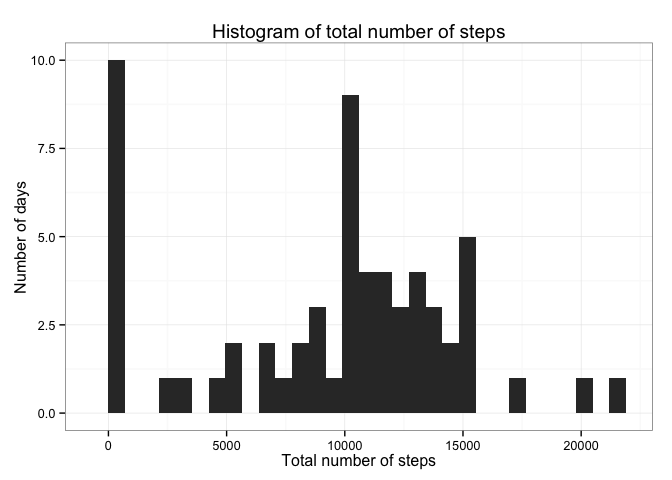

# Reproducible Research: Peer Assessment 1


## Overview
The objective of this document is to reproduce the analysis done to the activity dataset to answer a series of questions presented in this document. This assignment is part of Peer Assesment 1 for the Reproducible Research course from Coursera. More information about the assignment can be found [here] [1].

[1]: https://github.com/SebasJ23/RepData_PeerAssessment1/blob/master/README.md/ "here"

Before starting, please make sure you have completed all of the following instructions:

1. Download the activity dataset for the analysis. You can download it [here] [2].

2. Set your working directory to a folder containing both the PA1_template.Rmd file, used to produce this document, and the downloaded data from step 1.

[2]: https://github.com/SebasJ23/RepData_PeerAssessment1/blob/master/activity.zip?raw=true/ "here"

3. Install the following R packages: "ggplot2", "tidyr"


```r
library(ggplot2)
library(tidyr)
```

## Loading and preprocessing the data

1. Before starting to answer the questions, we will load the data and take a quick peek:


```r
if ("activity.csv" %in% dir()) {
    data <- read.csv("activity.csv", colClasses = c("integer", "Date", "integer"))
} else if ("activity.zip" %in% dir()) {
    unzip("activity.zip")
    data <- read.csv("activity.csv", colClasses = c("integer", "Date", "integer"))
}
str(data)
```

```
## 'data.frame':	17568 obs. of  3 variables:
##  $ steps   : int  NA NA NA NA NA NA NA NA NA NA ...
##  $ date    : Date, format: "2012-10-01" "2012-10-01" ...
##  $ interval: int  0 5 10 15 20 25 30 35 40 45 ...
```

## What is mean total number of steps taken per day?

1. Calculate the total number of steps taken per day.


```r
stepsByDay <- aggregate(data$steps, list(data$date), sum, na.rm = TRUE) # Calculate the total number of steps taken per day; Missing values (NAs) are ignored for this part of the analysis
names(stepsByDay) <- c("Date", "Total.Steps")
```

2. Make a histogram of the total number of steps taken each day.


```r
plot1 <- ggplot(stepsByDay, aes(Total.Steps)) +
    geom_histogram() +
    labs(title = "Histogram of total number of steps", x = "Total number of steps", y = "Number of days") +
    theme_bw()
print(plot1)
```

```
## stat_bin: binwidth defaulted to range/30. Use 'binwidth = x' to adjust this.
```

 

3. Calculate the mean and median of the total number of steps taken per day.


```r
stepsMean <- mean(stepsByDay$Total.Steps)
stepsMedian <- median(stepsByDay$Total.Steps)
```

Ommitting all the NAs from the inital dataset, the mean of the total number of steps taken per day is 9354.23 and the median is 10395.

## What is the average daily activity pattern?

1. Make a time series plot of the 5-minute interval and the average number of steps taken, averaged across all days.


```r
averageStepsInterval <- aggregate(data$steps, list(data$interval), mean, na.rm = TRUE) # Missing values (NAs) are ignored for this part of the analysis
names(averageStepsInterval) <- c("Interval", "Average.Steps")
plot2 <- ggplot(averageStepsInterval, aes(Interval, Average.Steps)) +
    geom_line() +
    labs(title = "Average number of steps in each 5-minute interval", y = "Average number of steps") +
    theme_bw()
print(plot2)
```

 

2. Which 5-minute interval, on average across all the days in the dataset, contains the maximum number of steps?


```r
maxSteps <- max(averageStepsInterval$Average.Steps)
maxInterval <- averageStepsInterval[which(averageStepsInterval$Average.Steps == maxSteps), 1]
```

With 206.17 steps on average, the 5-minute interval with maximum average number of steps across all days is interval number 835.

## Imputing missing values

1. Calculate total number of missing values in the dataset.


```r
numNA <- sum(!complete.cases(data)) # Calculate number of NAs
percentNA <- numNA/nrow(data) * 100 # Calculate % of NAs
```

In total, there are 2304 missing values in the activity dataset, which amounts to a total 13.11% of missing values.

2. Impute all the missing values (NAs) in the activity dataset.

To impute the data, all missing values will be replaced by the average number of steps for the 5-minute interval where the missing value is located.


```r
for (i in 1:nrow(data)) {
    if (is.na(data[i, 1])) {
        data[i, "stepsImputed"] <- averageStepsInterval[which(data[i, 3] == averageStepsInterval$Interval), 2] # Replaces NAs
    } else {
       data[i, "stepsImputed"] <- data[i, 1] # All non-NA values are retained
    }
}
str(data)
```

```
## 'data.frame':	17568 obs. of  4 variables:
##  $ steps       : int  NA NA NA NA NA NA NA NA NA NA ...
##  $ date        : Date, format: "2012-10-01" "2012-10-01" ...
##  $ interval    : int  0 5 10 15 20 25 30 35 40 45 ...
##  $ stepsImputed: num  1.717 0.3396 0.1321 0.1509 0.0755 ...
```

3. Create a new dataset that is equal to the original dataset but with the missing data filled in.


```r
data2 <- gather(data, Imputed, Steps, -date, -interval) # New dataset with steps in single column and a column specifing whether the observation comes from the original or imputed dataset
levels(data2$Imputed) <- c("Data not imputed", "Data imputed") # No: observation comes from original dataset; Yes: observation comes from imputed dataset.
```

4. Make a histogram of the total number of steps taken each day and calculate the mean and median total number of steps taken per day.


```r
stepsByDay2 <- aggregate(data2$Steps, c(list(data2$date), list(data2$Imputed)), sum, na.rm = TRUE) # Calculate total steps each day after imputation
names(stepsByDay2) <- c("Date", "Imputed", "Total.Steps")
plot3 <- ggplot(stepsByDay2, aes(Total.Steps)) +
    geom_histogram() +
    facet_grid(Imputed ~ .) +
    labs(title = "Histogram of total number of steps", x = "Total number of steps", y = "Number of days") +
    theme_bw()
print(plot3)
```

```
## stat_bin: binwidth defaulted to range/30. Use 'binwidth = x' to adjust this.
## stat_bin: binwidth defaulted to range/30. Use 'binwidth = x' to adjust this.
```

 

```r
#Calculate new mean and median:
stepsMeanNew <- mean(stepsByDay2[which(stepsByDay2$Imputed == "Data imputed"), 3])
stepsMedianNew <- median(stepsByDay2[which(stepsByDay2$Imputed == "Data imputed"), 3])
options(scipen = 1) # Sets scientific notation only for numbers > 10^5, so new mean and median are shown as regular numbers.
```

As shown earlier, ommitting all the NAs from the activity dataset produces a mean of the total number of steps taken per day of 9354.23 and a median of 10395. However, after imputation, the mean is 10766.19 and median is 10766.19.

## Are there differences in activity patterns between weekdays and weekends?

1. Create a new factor variable in the dataset indicating whether a given date is a weekday or weekend day.


```r
dataWeek <- data2[which(data2$Imputed == "Data imputed"), ] # This analysis is done with the imputed data
dataWeek$date <- as.Date(as.character(dataWeek$date))
dataWeek$Day <- as.factor(weekdays(dataWeek$date)) # New variable describing day of the week for the observation
levels(dataWeek$Day) <- c(rep("Weekdays", 2), rep("Weekend", 2), rep("Weekdays", 3)) # Change days for either "Weekdays" or "Weekend" as corresponds
averageStepsInterval2 <- aggregate(dataWeek$Steps, c(list(dataWeek$interval), list(dataWeek$Day)), mean) # Calculate average steps in weekdays and weekends for each interval
names(averageStepsInterval2) <- c("Interval", "Day", "Average.Steps")
```

2. Make a panel plot containing a time series plot of the 5-minute interval and the average number of steps taken, averaged across all weekday days or weekend days.


```r
plot4 <- ggplot(averageStepsInterval2, aes(x = Interval, y = Average.Steps)) +
    geom_line() +
    facet_grid(Day ~ .) +
    labs(title = "Average number of steps in each 5-minute interval", y = "Average number of steps") +
    theme_bw()
print(plot4)
```

 

The plot shows that, in weekdays, the period of greatest activity occurs early on, between interval numbered 750 and 1000, and then the activity decades, rarely surpassing the 100 steps in a five minute interval. However, in the case of the weekend, although the peak of activity does not reach that of the weekdays, the activity is much more evenly distributed across a larger period of time, specifically between the intervals numbered 750 and 2000.
